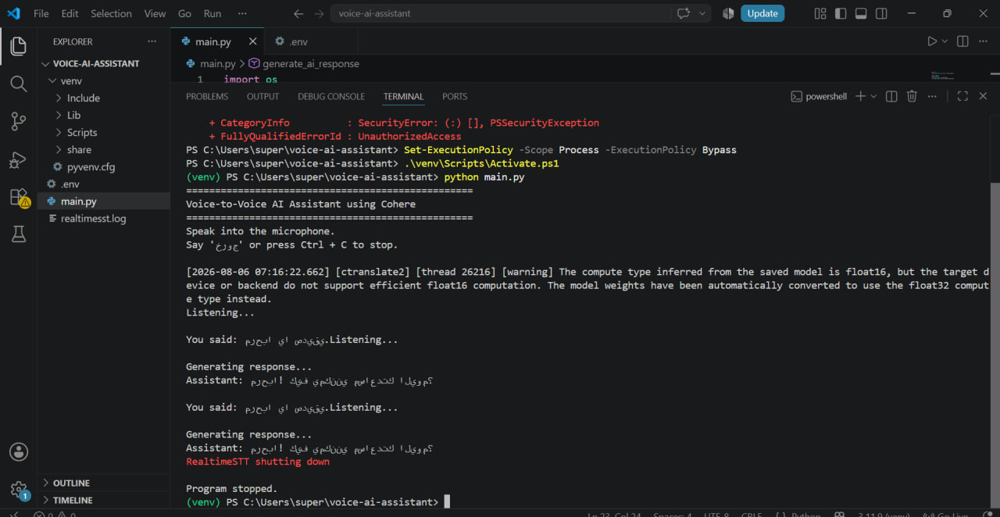

# 🎙️ Voice-to-Voice AI Assistant

A real-time AI voice assistant built with Python. The assistant listens to the user's speech through the microphone, converts speech into text using RealtimeSTT, sends the request to Cohere AI to generate a response, and finally converts the response back into speech using RealtimeTTS.

---

# Project Overview

This project demonstrates how different AI technologies can be combined to create an intelligent voice assistant capable of interacting with users through natural conversation.

The application continuously listens for voice input, processes spoken language, generates intelligent responses using a Large Language Model (LLM), and speaks the generated response back to the user.

---

# Features

-  Real-time Speech Recognition
-  AI-powered Responses using Cohere
-  Text-to-Speech Output
-  Continuous Voice Conversation
-  Built Completely with Python
-  Microphone Input Support
-  Natural Language Conversations

---

# Technologies Used

- Python 3.11
- RealtimeSTT
- RealtimeTTS
- Faster-Whisper
- Cohere API
- PyAudio
- CTranslate2
- Torch
- VS Code

---

# Project Workflow

1. User speaks into the microphone.
2. RealtimeSTT converts speech into text.
3. The text is sent to Cohere AI.
4. Cohere generates an intelligent response.
5. RealtimeTTS converts the response into speech.
6. The assistant speaks the answer back to the user.

---

# Screenshot

The following image shows the application running successfully inside Visual Studio Code.



---

# Installation

Clone the repository

```bash
git clone https://github.com/USERNAME/voice-ai-assistant.git
```

Move into the project folder

```bash
cd voice-ai-assistant
```

Create a virtual environment

```bash
python -m venv venv
```

Activate the virtual environment

Windows

```bash
venv\Scripts\activate
```

Install all dependencies

```bash
pip install -r requirements.txt
```

---

# Configuration

Create a `.env` file inside the project directory.

Add your Cohere API key:

```env
COHERE_API_KEY=YOUR_API_KEY
```

---

# Run the Project

```bash
python main.py
```

---

# Requirements

- Python 3.11+
- Internet Connection
- Microphone
- Cohere API Key

---

# Project Structure

```
voice-ai-assistant/
│
├── main.py
├── requirements.txt
├── README.md
├── .env
├── demo.jpg
└── venv/
```

---

# Notes

- The `.env` file is not uploaded for security reasons.
- The `venv` folder should not be uploaded to GitHub.
- The assistant requires an active internet connection to communicate with the Cohere API.

---

# Author

Developed as a Voice AI Assistant project using Python, RealtimeSTT, RealtimeTTS, and Cohere AI.
